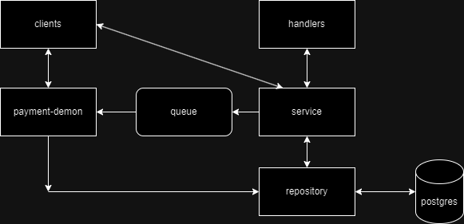

# Платежная система API

Сервис на Go, который обрабатывает платежи, конвертацию валют и интеграцию с API YooMoney и FastForex. Предоставляет API на базе gRPC для управления платежами, проверки статусов платежей и конвертации валют.

---

## Содержание

1. [Обзор](#обзор)
2. [Особенности](#особенности)
3. [Технологии](#технологии)
4. [Структура](#структура)
5. [Эндпоинты](#эндпоинты)
6. [Возможные проблемы](#возможные_проблемы)

---

## Обзор

Этот проект предназначен для интеграции обработки платежей, конвертации валют в единую систему. Использует FastForex для конвертации валют, YooMoney для обработки платежей. Сервис можно расширять за счет добавления дополнительных платежных шлюзов или API конвертации валют по мере необходимости.

---

## Особенности

- **Конвертация валют**: Конвертация между различными валютами с использованием API FastForex.
- **Интеграция с YooMoney**: Проведение платежей, проверка статусов платежей и генерация быстрых ссылок на платежи через API YooMoney.
- **API на gRPC**: Предоставление интерфейса gRPC для взаимодействия с сервисами платежей.
- **Поддержка БД**: Использование PostgreSQL и Redis для хранения данных и кэширования.
- **Асинхронная обработка платежей**: Демон в фоновом режиме обрабатывает платежи и проверяет их статусы.
- **Логирование ошибок**: Подробные логи ошибок и статусов с использованием библиотеки Zap.

---

## Технологии

- **Go (Golang)**: Основной язык программирования.
- **gRPC**: Для связи между сервисами и API.
- **PostgreSQL**: Для управления базой данных.
- **Redis**: Для кэширования и очередей сообщений.
- **API YooMoney**: Для обработки платежей.
- **API FastForex**: Для конвертации валют.
- **Zap**: Структурированное и многоуровневое логирование.
- **Cleanenv**: Для работы с конфигурацией через переменные окружения.

---

## Структура

Сервис использует слоистую архитектуру: слой ручек, слой сервиса (бизнес-логика) и слой репозитория (работа с БД).

Для повышения отказоустойчивости и проверки платежей был написан демон, который проходит по очереди и проверяет платежи. Если все нормально, то платеж, в зависимости от статуса обрабатывается, иначе снова попадает в очередь.

Пояснения по структуре файлов:

- **build**: файлы необходимые для запуска и развертывания приложения
- **configs**: файлы конфигураций приложения
- **deployments**: здесь docker-compose
- **internal**: clients - клиенты приложения для api и gRPC запросов; config - конфигурация приложения; db - подключение к базе данных, работа с очередью и redis; handlers - слой ручек; models - модель payments и статусы оплаты; payment-demon - проверка оплаты и работа со счетами; payment-service - сервисный слой с бизнес-логикой приложения; repository - слой репозитория с работой с базой данных; utils - логгер. 
- **migrations**: файлы миграций
- **proto**: файлы с прото-контрактами для gRPC
- **main.go**: файл с инициализацией всех объектов приложения
- **Makefile**: файл для сборки и запуска приложения
- **Tests**: тесты сервиса

Как примерно работает:

---

## Эндпоинты

- **Create Payment**: создание платежа - id отправляющего, id получающего, сумма и валюта; id созданного платежа
- **Get Payment**: получение статуса платежа, проверка оплаты - id платежа; статус платежа
- **Get Payment by ID**: получение данных платежа - id платежа; id платежа, id отправителя и получателя, сумма, валюта, статус платежа, время создания и время изменения
- **Refund Payment**: возврат платежа - id платежа; статус платежа
- **Get Payment History**: получение истории платежей - user_id, страница, лимит; данные всех платежей пользователя с лимитом и оффсетом
- **Get Payment Link**: получение ссылки на оплату - id платежа; ссылка на оплату
- **Get Active Payments**: получение активных счетов на оплату - id пользователя; данные всех активных платежей пользователя

---

## Возможные проблемы

- **Failed to verify certificate: x509** - при запросе к api clients. 
- **Фикс**: обновление сертификатов системы (добавление Zscaler’s сертификата с расширением .crt)
1. sudo update-ca-certificates --fresh (Скорее всего, сертификат для Zscaler не будет отображаться). 
2. Скачайте корневой сертификат Zscaler в формате DER и преобразуйте его в PEM (но убедитесь, что у файла расширение .crt, иначе это не сработает). 
3. Скопируйте файл CRT (в моем случае я назвал его Zscaler.crt) в каталог /usr/local/share/ca-certificates. 
4. Выполните эту команду снова: sudo update-ca-certificates --fresh 
5. Система прочитает файл CRT и добавит его в доступный хранилище корневых сертификатов на вашей машине с Linux.

---
